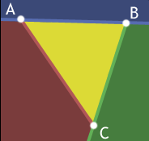
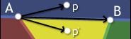

转译： http://blackpawn.com/texts/pointinpoly/ 

# Point in triangle(点在三角形内)

## Same Side Technique(同侧技术)

检测点是否在三角形内最基础的方式是连接点到三角形每个定点组成三个向量，并求三个向量组成的三个角的度数和。如果和为2 * pi，则在三角形内部，否则不在。



如上图，如果一个点在三角形ABC中，则它一定在AB下面，在AC右侧，在BC左侧。

### 判断点在一条直线的一侧



如上图，$\vec{AB}$与$\vec{Ap}$的叉积所得向量为指向屏幕之外的向量。$\vec{AB}$与$\vec{Ap^{'}}$的叉积所得向量为指向屏幕之内的向量。直线AB上面所有的点与A点组成的向量与$\vec{AB}$的叉积都指向屏幕外，而直线AB下面所有的点与A点组成的向量与$\vec{AB}$的叉积都指向屏幕内。

问题：如何知道叉积应该指向哪个方向？

由于三角形可以在3d空间中以任何方式定向，因此没有可以与之比较的设置值 。相反，我们需要一个参考点，对于AB来说参考点就是C。

因此，$\vec{AB}$与$\vec{Ap}$的叉积与$\vec{AB}$与$\vec{AC}$的叉积同方向，则该点与C在AB的同侧，其他的三条边也是同样的处理，如果都是同侧，则在三角形内，否则不再。

``` csharp
bool SameSide(p1, p2, a, b)
{
    cp1 = Cross(b - a, p1 - a);
	cp2 = Cross(b - a, p2 - a);
	if (Dot(cp1, cp2) >= 0) return true;
	return false;
}

bool PointInTriangle(p, a, b, c)
{
    if (SameSide(p, a, b, c) and SameSide(p, b, a, c) and SameSide(p, c, a, b))
    {
        return true;
    }
    return false;
}
```

* 优点：简单，有效，易理解。
* 缺点：速度稍慢。

## 重心

三角形的三个点定义了一个空间平面。选择一个点，我们可以考虑平面上相对于该点的所有其他位置。让我们选择A为远点，$\vec{AB}$和$\vec{AC}$为基向量，则我们可以用AB和AC表示平面上所有的点。公式为：
$$
P = A + u * (C - A) + v * (B - A)
$$

* 如果u或v < 0，则点P一定在三角形外。
* 如果u或v > 1，则点P一定在三角形外。
* 如果u+v > 1，则点P一定在三角形外。

原始方程式：
$$
P = A + u *(C-A)+ v *(B-A)
$$
两者均减去A边：
$$
(P-A)= u *(C-A)+ v *(B-A)
$$
用$v0$，$v1$，$v2$代替，以减少编写：
$$
v2 = u * v0 + v * v1
$$
有两个未知数（u和v），因此我们需要两个方程式才能为其求解

乘$v0$：
$$
(v2) . v0 = (u * v0 + v * v1) . v0
$$
乘$v1$：
$$
(v2) . v1 = (u * v0 + v * v1) . v1
$$
推导出：
$$
v2 . v0 = u * (v0 . v0) + v * (v1 . v0)
$$

$$
v2 . v1 = u * (v0 . v1) + v * (v1 . v1)
$$

现在我们有两个方程和两个未知数，可以求解一个变量的方程式，然后代入另一个变量
$$
u = ((v1.v1)(v2.v0)-(v1.v0)(v2.v1)) / ((v0.v0)(v1.v1) - (v0.v1)(v1.v0))
$$

$$
v = ((v0.v0)(v2.v1)-(v0.v1)(v2.v0)) / ((v0.v0)(v1.v1) - (v0.v1)(v1.v0))
$$

``` csharp
bool PointInTriangle(vec3 A, vec3 B, vec3 C, vec3 P)
{
    // Compute vectors
    vec3 v0 = C - A;
    vec3 v1 = B - A;
    vec3 v2 = P - A;
    
    // Compute dot products
    dot00 = Dot(v0, v0);
    dot01 = Dot(v0, v1);
    dot02 = Dot(v0, v2);
    dot11 = Dot(v1, v1);
    dot12 = Dot(v1, v2);
    
    // Compute barycentric coordinates
    float invDenom = 1 / (dot00 * dot11 - dot01 * dot01);
    float u = (dot11 * dot02 - dot01 * dot12) * invDenom;
    float v = (dot00 * dot12 - dot01 * dot02) * invDenom;
    
    // Check if point is in triangle
    return (u >= 0) && (v >= 0) && (u + v < 1)
}
```