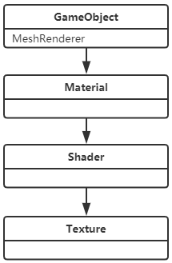
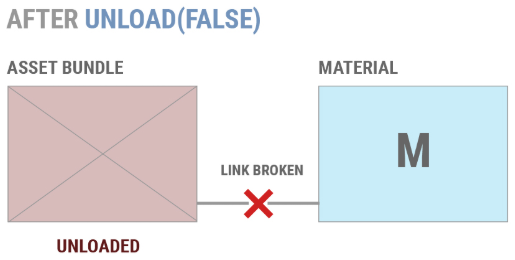

# AssetBundle

包含非代码资产（如Models，Texture，Prefabs，Audio clips，Scenes）Unity可以在运行（run time）的时候加载。为了通过网络快速传输，可用（LZMA和LZ4）内置压缩算法压缩AssetBundles。

## AssetBundle 有什么用？

AssetBundle是磁盘中的实际文件，它的存档是一个容器，包含这两种类型的文件：

- 序列化文件
- 资源文件（二进制数据块）

------

## AssetBundle的分包策略

### 逻辑实体分组

指资源根据项目的功能部分进行分包，如用户界面，字符等，如：

* 用户UI所有的纹理和布局数据
* 字符/字符集所有的模型和动画

逻辑实体分组是可下载内容（DLC）的理想选择，开发人员必须准确熟悉项目使用的每个资源的时间和地点

### 类型分组

将例如声音或者本地化文件分配给单独的AssetBundle

类型分组是构建AssetBundle以供多个平台使用的更好的策略之一

### 并发内容分组

适用于关卡类型的游戏，在同一时间只会用到其中一个AssetBundle

### 分组注意事项：

* 强频繁更新的对象拆分为AssetBundle，与很少更新的对象分开
* 对可能同时加载的对象进行分组
* 如果多个AssetBundle中的多个对象以来与来自完全不同的AssetBundle的单个资产，则将以来项移动到单独的AssetBundle中
* 如果多个AssetBundle引用其他AssetBundle中的同一组资产，则将这些依赖放入共享AssetBundle以减少重复
* 如果一个AssetBundle中的两组对象不可能同时加载（比如低模和高模），则将其分成两个AssetBundle
* 考虑合并小型（少于5到10个Asset）但其内容经常同时加载的AssetBundle
* 如果同时经常加载一个AssetBundle其中50%的资源，考虑分AssetBundle
* 一组对象只是同一对象的不同版本，考虑AssetBundle Variants

------

## 构建AssetBundle

*  BuildAssetBundleOptions：Unity提供了三种特定的压缩方式：
   *  BuildAssetBundleOptions.None：使用LZMA格式压缩，压缩成序列化数据文件流。解压缩后会使用LZ4压缩格式重新再本地磁盘上压缩
      *  优点：文件小
      *  缺点：解压缩，加载时间略长。如要使用包中的任何资源，必须先解压缩整个包
   *  BuildAssetBundleOptions.UncompressedAssetBundle：不压缩
      *  优点：加载速度快
      *  缺点：包体大
   *  BuildAssetBundleOptions.ChunkBasedCompression：使用LZ4格式压缩
      *  优点：比LZMA大，比不压缩小，不需要使用资源解压整个包，加载速度相当于未压缩。
*  BuildTarget：表明AssetBundle使用的目标平台

```csharp
using UnityEditor;
using System.IO;

public class CreateAssetBundles
{
    [MenuItem("Assets/Build AssetBundles")]
    static void BuildAllAssetBundles()
    {
        string assetBundleDirectory = "Assets/AssetBundles";
        if(!Directory.Exists(assetBundleDirectory))
        {
            Directory.CreateDirectory(assetBundleDirectory);
        }
		BuildPipeline.BuildAssetBundles(assetBundleDirectory, BuildAssetBundleOptions.None, BuildTarget.StandaloneWindows);
    }
}
```

### 构建文件解析

#### AssetBundle文件

非.manifest扩展名的文件，包含运行时加载以及资源的内容，包体结构分为两种，普通AssetBundle和Scene AssetBundle

* 普通AssetBundle结构：


* Scene AssetBundle：针对Scene的流加载优化

#### 清单文件

对于生成的每个包（包括附加的Manifest Bundle），都会生成关联的清单文件。包含循环亢余校验（CRC）数据和包体的依赖数据等信息

普通AssetBundle清单信息

```json
ManifestFileVersion: 0
CRC: 3507989386 // 循环亢余校验
Hashes:
  AssetFileHash:
    serializedVersion: 2
    Hash: 8389c134be6df93381072ffcc166568f
  TypeTreeHash:
    serializedVersion: 2
    Hash: c0f34e0e405254bd5ec86cc7a8aa1b79
HashAppended: 0
ClassTypes:
- Class: 1
  Script: {instanceID: 0}
- Class: 4
  Script: {instanceID: 0}
- Class: 21
  Script: {instanceID: 0}
- Class: 23
  Script: {instanceID: 0}
- Class: 48
  Script: {instanceID: 0}
- Class: 84
  Script: {instanceID: 0}
- Class: 114
  Script: {fileID: 11500000, guid: 0d2d6d01e1a89684e87fe223c792fc41, type: 3}
- Class: 115
  Script: {instanceID: 0}
Assets: // 资源地址
- Assets/Art/NewSurfaceShader.shader
- Assets/Art/GameObject.prefab
- Assets/Art/New Render Texture.renderTexture
- Assets/Art/New Material.mat
Dependencies: [] // 依赖
```

生成的Manifest Bundle清单信息

```json
ManifestFileVersion: 0
CRC: 4271312968 // 循环亢余校验
AssetBundleManifest:
  AssetBundleInfos:
    Info_0:
      Name: asset1.a
      Dependencies: {} // 依赖
```

### 依赖



如果我们的工程中有图中的资源个一个，各个资源的引用关系也如图所示，GameObject的组建MeshRenderer引用Material，Material引用shader，Shader引用Texture。

下面举例依赖的情况：

1. GameObject，Material和Shader打包asset.a，Texture打包asset.b。asset.a包会依赖asset.b包，并且加载asset.a包的时候必须先加载asset.b包。下面是两个包的依赖项：

   1. asset.a:

   ```c++
   Dependencies:
   - D:Unity/Programs/AssetBundleTest/Assets/AssetBundles/asset.b
   ```

   2. asset.b:

   ```c++
   Dependencies: []
   ```

2. GameObject，Shader和Texture打包asset.a，Material打包asset.b。两个包互相依赖。下面是两个包的依赖项：

   1. asset.a

   ```c++
   Dependencies:
   - D:Unity/Programs/AssetBundleTest/Assets/AssetBundles/asset.b
   ```

   2. asset.b

   ```c++
   Dependencies:
   - D:Unity/Programs/AssetBundleTest/Assets/AssetBundles/asset.a
   ```

3. Prefab1引用Material1和Material2。Prefab2也引用Material1和Material2。我们将Prefab1打入asset.a包，将Prefab2打入asset.b包。Material1和Material2不打包。则asset.a和asset.b包中都应该有Material1和Material2的副本。（实际测试没有）

------

## 加载AssetBundle

### AssetBundle.LoadFromMemoryAsync

此方法从一个字节数组中加载AssetBundle数据（数据为字节数组），如果是LZMA压缩格式的话，会在加载时解压，LZ4压缩格式则直接加载不解压。

File.ReadAllBytes(path)：用字节方式读取数据

### AssetBundle.LoadFromFile

加载未压缩AssetBundle时非常高效。加载未压缩或LZ4压缩格式，将直接从磁盘加载AssetBundle。加载LZMA格式压缩包时，先解压，然后再加载到内存中。

### UnityWebRequest


```csharp
IEnumerator UnityWebRequestLoadAssetBundleAndInstantiate()
{
    string url = "file:///" + Application.dataPath + "/AssetBundles/" + assetBundleName;
    UnityEngine.Networking.UnityWebRequest request = UnityEngine.Networking.UnityWebRequest.GetAssetBundle(uri, 0); // 下载AssetBundle请求
    yield return request.Send();
    AssetBundle bundle = DownloadHandlerAssetBundle.GetContent(request); // 更高效的下载和解压AssetBundle
    GameObject cube = bundle.LoadAsset<GameObject>();
    Instantiate(cube);
}
```

### 从AssetBundle加载资源

通过上面三种加载AssetBundle的方式，将AssetBundle加载到内存中，接下来就要加载AssetBundle中的Asset，并且实例化到游戏中了

#### 加载Asset

```csharp
// T：加载Asset的类型
// bundle：AssetBundle对象
// assetName：资源名

// LoadAsset：加载一个资源
T assetObject = bundle.LoadAsset<T>(assetName);

// LoadAllAssets：加载AssetBundle中的全部资源
Unity.Object[] assetObjectArray = bundle.LoadAllAssets();

// LoadAssetAsync：异步加载一个资源
AssetBundleRequest request = bundle.LoadAssetAsync<T>(assetName);
yield return request;
var assetObject = request.asset;

// LoadAllAssetAsync：异步加载全部资源
AssetBundleRequest request = bundle.LoadAllAssetsAsync();
yield return request;
var assetObjectArray = request.allAssets;
```

#### 加载AssetBundle Manifest

处理AssetBundle的依赖时候，需要用到AssetBundleManifest对象。

```csharp
// 将AssetBundle的依赖加载出来
AssetBundle assetBundle = AssetBundle.LoadFromFile(Path.Combine("Assets/AssetBundles", "AssetBundles"));
// 加载manifest，名字固定为"AssetBundleManifest"
AssetBundleManifest manifest = bundle.LoadAsset<AssetBundleManifest>("AssetBundleManifest");
// 加载依赖数据
string[] dependencies = manifest.GetAllDependencies("assetBundle");
foreach (string dependency in dependencies)
{
    // 加载依赖的AssetBundle
    AssetBundle.LoadFromFile(Path.Combine("Assets/AssetBundles", dependncy));
}
```

## 卸载AssetBundle

### AssetBundle.Unload(bool)

* AssetBundle.Unload(true)：卸载从AssetBundle中加载的所有GameObject（及其依赖项）。不包括实例化的GameObject（实例化的GameObject周期不归AssetBundle管理）。实例化的Material会被卸载并销毁，Texture同理。
* AssetBundle.Unload(false)：破坏Material与其实例的链接，不会回收实例化的Material。如果再调用AssetBundle.LoadAsset()再次加载此Material则会实例化一个新材质，并不会链接直接未被销毁的材质。




推荐使用AssetBundle.Unload(true)卸载来确保对象不会重复。常用两种卸载时间点：

* 在生命周期中的明确切换点，例如升级或屏幕加载期间。
* 维护单个对象的引用计数，并仅在所有对象未使用时卸载AssetBundle。

使用AssetBundle.Unload(false)后卸载内存留存对象的方法：

* 消除场景中和代码中对不需要的Object的所有引用后，调用Resources.UnloadUnusedAssets。
* 非添加性的加载场景(AddScene)，Unity会自动卸载所有场景对象并自动调用Resources.UnloadUnusedAssets。

