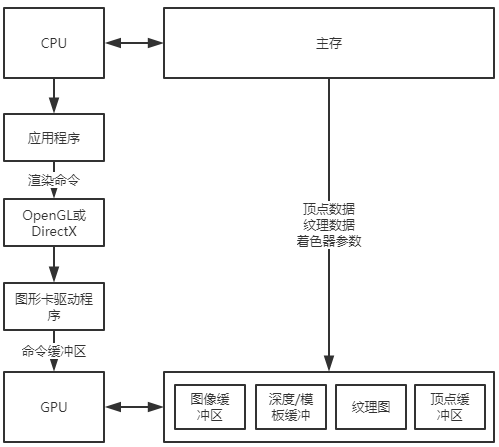

# chapter 1 : 渲染管线

## 重点记录

* GPU接收CPU的命令执行渲染操作，CPU则继续执行其他任务，这被称为异步操作
* 滞后时间：提交渲染命令到完成渲染的时间
* 避免使用OpenGL中CPU程序确认GPU渲染命令执行完成时间（变成同步操作，影响效率）

* 显示随机存储器(Video Random Access Memory, VRAM)，简称显存
* 当后缓冲区完全渲染，前后缓冲区交换，此操作成为缓冲区切换（修改基地址或复制实现交换）
